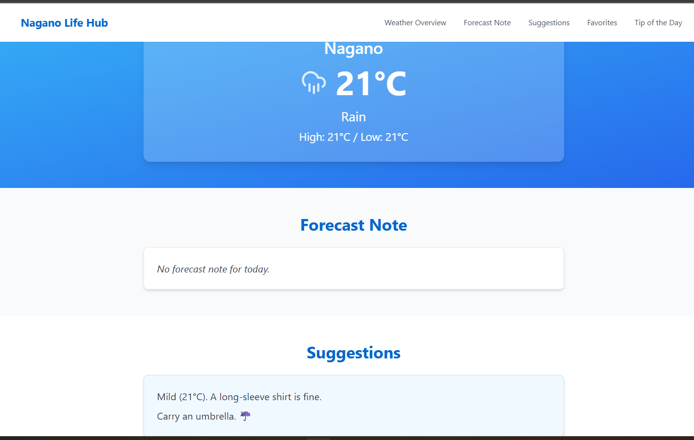

# 📷 Splash Image Gallery

A weather app specifically built for **Nagano, Japan** with a clean design and some extra functionalities 

## 🚀 Features

- 🌦️ Real-time weather data for Nagano
- 📷 Dynamic background or image integration (Splash-style)
- 📱 Responsive design for both mobile and desktop
- 🔁 Auto-refresh / dynamic update (if applicable)
- ⚡ Deployed with Fly.io

## 🖼️ Screenshots

- **Homepage**

  

## 🛠️ Tech Stack

- HTML/CSS
- JavaScript
- Weather API (e.g., OpenWeatherMap)
- Fly.io for deployment

## Website link: https://vqh-nagano-weather.fly.dev/