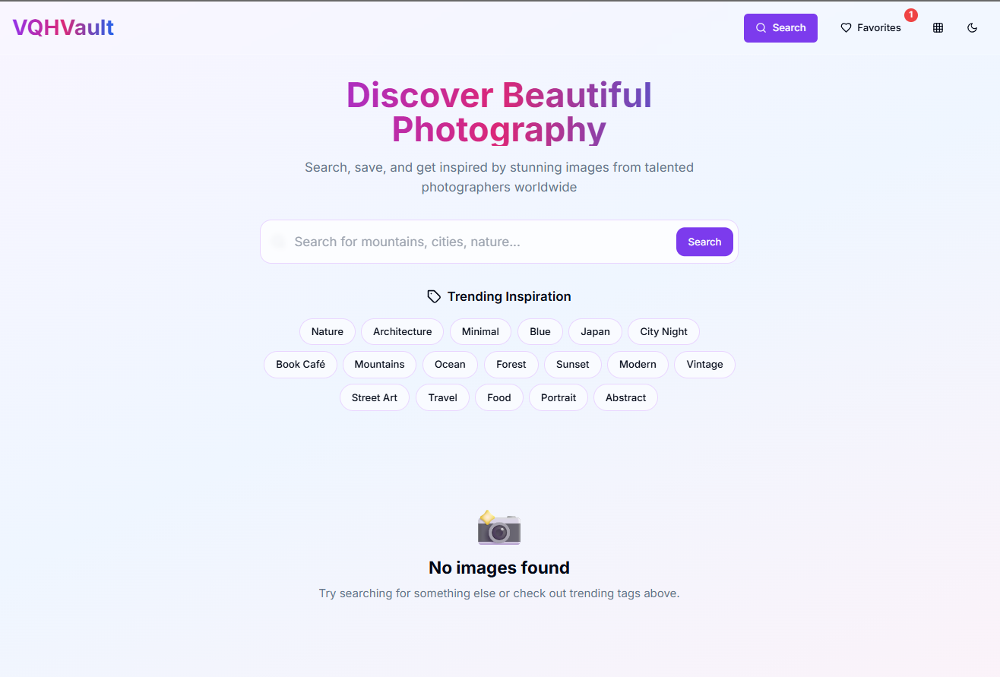
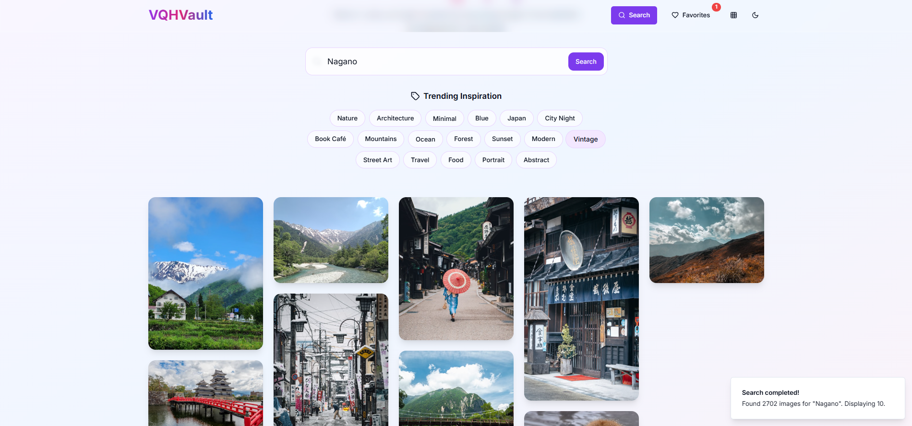
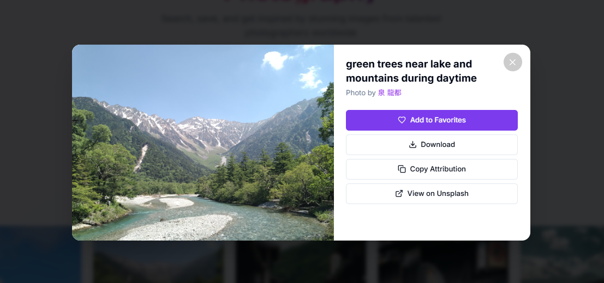

# 📷 Splash Image Gallery

A simple and elegant web application that uses the Unsplash API to fetch and display stunning images with interactive features.

## 🚀 Features

- 🔍 Search and view high-quality images from Unsplash
- ❤️ Add images to favorites
- ⬇️ Download images directly
- 📋 Copy photographer attribution easily
- 🔗 Open image on Unsplash

## 🖼️ Screenshots

- **Homepage**
  
  

- **Image Searching**
  
  

- **Image Viewing**
  
  

## 🛠️ Tech Stack

- HTML/CSS
- JavaScript
- Supabase

## Website link: https://vqh-vault.fly.dev/