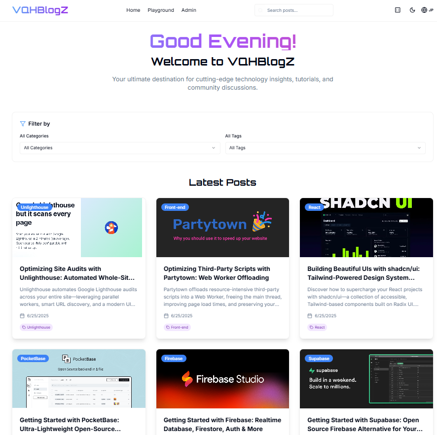
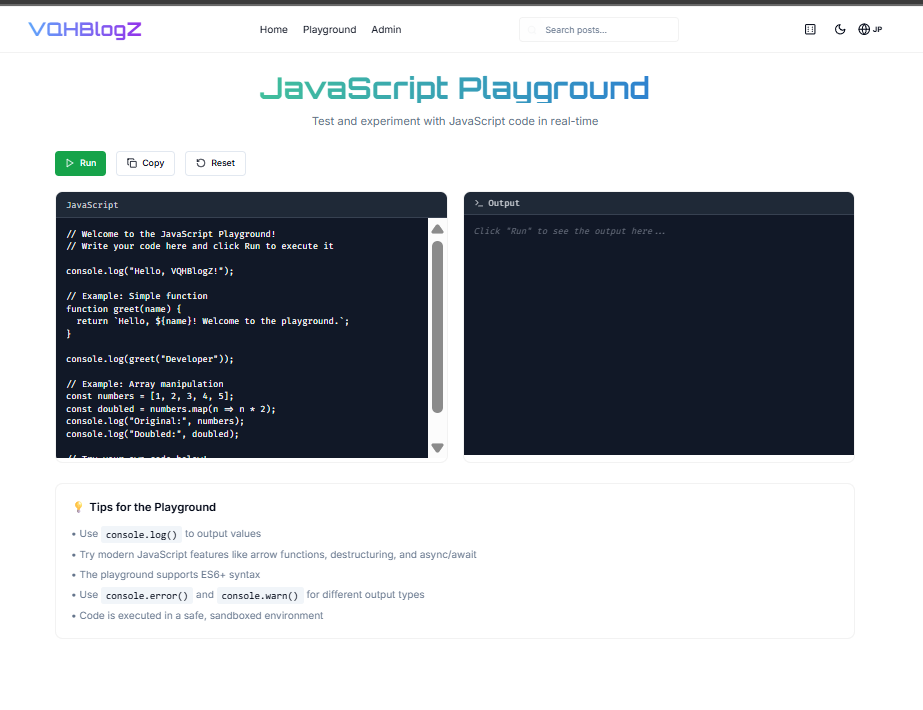
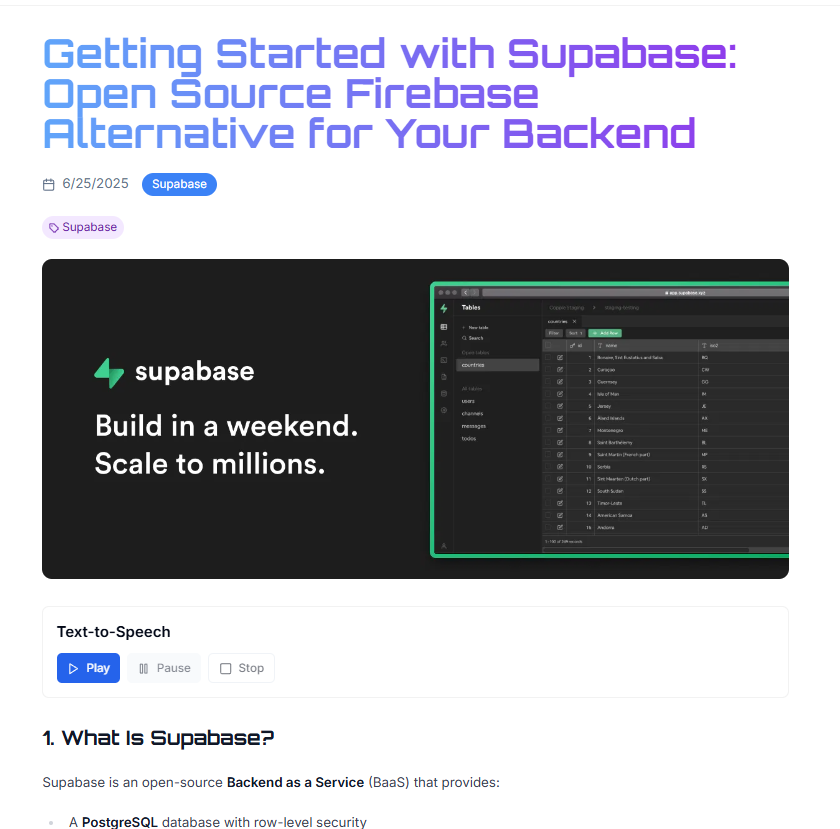
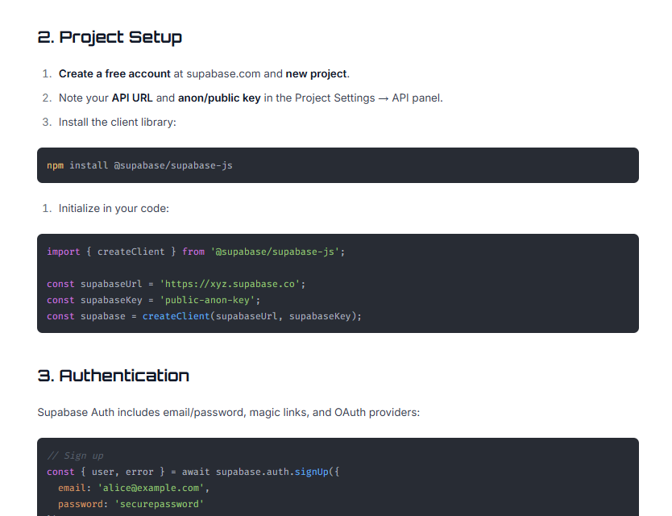
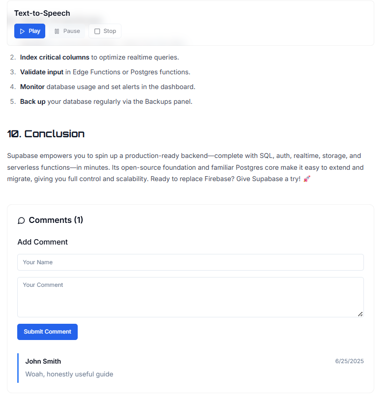

# 📝 VQHBlogZ

A rich, interactive articles website

## 🚀 Features

- 🌗 **Light/Dark Mode**: Seamlessly switch between themes for comfortable reading any time of day.  
- 🌐 **Multilingual Support**: Toggle between English and Japanese.  
- 📂 **Category & Tag Filters**: Quickly narrow down posts by your interests.  
- 🖥️ **JavaScript Playground**: Write, run, copy, and reset JS snippets in real time.  
- 🔊 **Text-to-Speech**: Listen to any article with play, pause, and stop controls.  
- 🔐 **Admin Panel**: Manage content (draft, publish, edit) from a dedicated interface.  

## 🖼️ Screenshots

- **Homepage**  
  

- **JavaScript Playground**  
  

- **Blog Post View**  
  
  
  

## 🛠️ Tech Stack

- **Framework**:React with Vite 
- **Styling**: Tailwind CSS  
- **Backend/API**: Supabase
- **Hosting**: Fly.io   

## 🔗 Live Demo

https://vqh-blogz.fly.dev/
